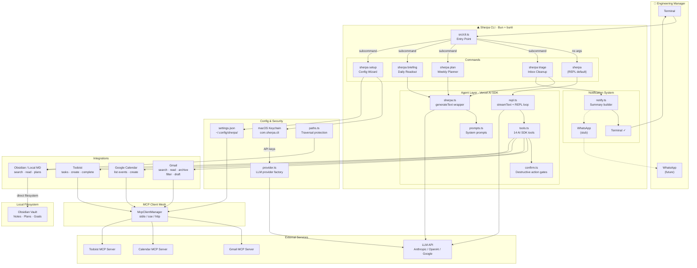

# ⛰ Sherpa

**The Command-Line Guide for the Sociotechnical Leader**

Sherpa is a local-first CLI that acts as an agentic guide for Engineering Managers. It consolidates Gmail, Google Calendar, Todoist, and your local notes into a single terminal experience — powered by the [Model Context Protocol](https://modelcontextprotocol.io) and the [Vercel AI SDK](https://sdk.vercel.ai).

```
              /\
             /  \
            / ⛰  \
           /      \
          / ~~~~~~ \
         /  ~~~~~~  \
        /          \
       /    ____    \
      /    |    |    \
     /     |    |     \
    /______|____|______\

         S H E R P A
```

## What it does

- **`sherpa`** — conversational mode. Talk naturally: "triage my inbox", "what's my day look like", "plan my week"
- **`sherpa triage`** — guided inbox cleanup. AI categorizes emails, you choose: archive, filter forever, create task, or draft reply
- **`sherpa plan`** — weekly planner. Pulls calendar, tasks, and your goals/plans into a battle plan
- **`sherpa briefing`** — morning readout. Today's meetings, tasks, and inbox synthesized into 30 lines
- **`sherpa setup`** — interactive wizard to connect Gmail, Calendar, Todoist, and your notes

## Install

### Prerequisites

- [Bun](https://bun.sh) runtime (v1.0+)
- An LLM API key — [Anthropic](https://console.anthropic.com), [OpenAI](https://platform.openai.com), or [Google](https://aistudio.google.com)
- A [Google Cloud project](https://console.cloud.google.com) with Gmail API enabled (for inbox features)

### From source

```bash
git clone https://github.com/ojoaldato/sherpa.git
cd sherpa
bun install
```

### Gmail authentication

Sherpa uses [server-gmail-autoauth-mcp](https://github.com/gongrzhe/server-gmail-autoauth-mcp) for Gmail access. One-time setup:

1. Create OAuth credentials in [Google Cloud Console](https://console.cloud.google.com/apis/credentials) (Desktop app type)
2. Download the JSON and place it at `~/.gmail-mcp/gcp-oauth.keys.json`
3. Run auth:

```bash
npx @gongrzhe/server-gmail-autoauth-mcp auth
```

This opens a browser for Google login and saves credentials locally.

### Configure Sherpa

```bash
bun src/cli.ts setup
```

The wizard walks you through:
- LLM provider (Anthropic, OpenAI, or Google) and API key — stored in macOS Keychain
- Model selection (defaults to provider's best)
- Obsidian vault / local markdown path
- Gmail, Calendar, and Todoist MCP server commands

Config is saved to `~/.config/sherpa/`.

## Usage

### Conversational mode (default)

```bash
bun src/cli.ts
```

Type naturally — Sherpa figures out which tools to call:

```
you> triage my inbox

  Fetching unread emails...
  Found 14 messages. Analyzing...

  I'd recommend:
  - Archive 8 (notifications, newsletters)
  - Filter 2 senders permanently
  - Create tasks for 2 follow-ups
  - Draft reply to 1 from your VP

  ⚠ Archive 8 emails? (low-value notifications) [y/n]
```

### Direct commands

```bash
bun src/cli.ts triage              # Guided inbox triage
bun src/cli.ts triage -c 50       # Fetch more emails
bun src/cli.ts plan                # Weekly planner
bun src/cli.ts plan -d 14         # Two-week lookahead
bun src/cli.ts briefing            # Morning briefing
```

### Triage actions

For each email in triage, you can:

| Action | What it does |
| --- | --- |
| **Ignore** | Archive the email |
| **Filter** | Archive + create a Gmail filter to auto-archive this sender/domain forever |
| **Todoist** | Create a follow-up task with due date, then archive |
| **Reply** | AI drafts a reply, you edit/approve, saved as Gmail draft |

A summary prints after every triage session:

```
┌─ Triage Summary ─────────────────────────────
│ Inbox Triage Summary — Sun, Feb 22, 11:45 AM
│
│ 25 emails reviewed, 18 acted on
│
│   Archived:  12
│   Filtered:  3
│   Tasks:     2
│   Drafts:    1
│   Skipped:   7
│
│ Follow-ups:
│   ☐ Follow up: Q1 Planning (due: tomorrow)
│   ✉ Reply to vp@company.com: Budget Review
└──────────────────────────────────────────────
```

## Architecture



## Project structure

```
src/
  cli.ts              # Entry point — no args → REPL, subcommand → router
  commands/            # triage, plan, briefing, setup, chat
  agent/               # AI: REPL loop, tools, prompts, confirmations
  mcp/                 # MCP client manager (stdio/sse/http)
  integrations/        # Gmail, Calendar, Todoist, Obsidian wrappers
  config/              # Settings, env, Keychain, LLM provider
  utils/               # Logger, formatters, notifications, path guards
```

## Building

```bash
bun run build                      # JS bundle
bunli build --targets native       # Standalone binary
```

## Contributing

Sherpa is open source. See [ROADMAP.md](ROADMAP.md) for what's planned and [CLAUDE.md](CLAUDE.md) for codebase conventions.

```bash
bun install
bun run dev -- triage              # Dev mode with hot reload
bun test                           # Run tests
```

## Security

- API keys are stored in **macOS Keychain** (`com.sherpa.cli`), not in plaintext files. Run `sherpa setup` to store them securely.
- Local document access (Obsidian, markdown) is restricted to directories you configure. Sherpa will refuse to read files outside those paths.
- Gmail, Calendar, and Todoist access goes through MCP servers with OAuth credentials stored locally at `~/.gmail-mcp/`.
- No data is sent anywhere except your chosen LLM API (Anthropic, OpenAI, or Google). Sherpa is local-first.

## License

MIT — see [LICENSE](LICENSE)
